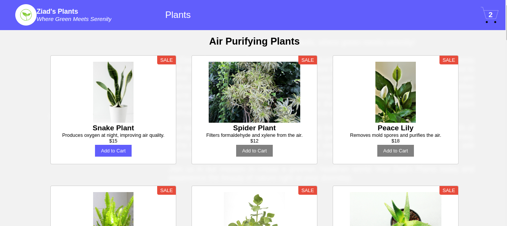
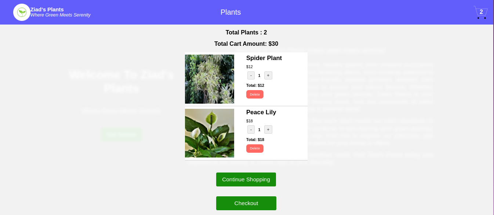

# E-commerce Website 🌱




Welcome to **E-commerce Website**, where green meets serenity! This project is a small e-commerce website built using **React** as part of my learning journey in **Full-Stack Development** with IBM. The website is now live on **GitHub Pages** and showcases a variety of plants that can be purchased online.

## 🚀 Live Demo

Check out the live demo of the website [here](https://santanaoliva-u.github.io/e-plantShopping).

## 🌟 Features

- **React** for building the front end.
- **Redux** for state management.
- **Vite** for fast development and production builds.
- **Responsive design** to ensure a smooth experience across all devices.
- **E-commerce functionality**, including Add to Cart and Checkout buttons.
- Organized product categories like Air Purifying Plants, Aromatic Fragrant Plants, Insect Repellent Plants, and more.

## 📚 Learning Journey

This project is part of my **Full-Stack Development** course with IBM. It's a hands-on project that has helped me apply the concepts I've learned, from front-end development to deploying on GitHub Pages.

## 🛠️ Technologies Used

- **React**
- **Redux Toolkit**
- **Vite**
- **CSS Modules**
- **GitHub Pages** for deployment

## 📂 Project Structure

```bash
.
├── public
├── src
│   ├── components
│   ├── redux
│   ├── styles
│   ├── App.jsx
│   └── main.jsx
├── README.md
└── package.json
```

## 🛠️ Installation Guide

Follow these steps to set up and run the project locally:

### Prerequisites

1. **Node.js**: Install Node.js from [here](https://nodejs.org/).
2. **Git**: Ensure Git is installed. Download it from [here](https://git-scm.com/).

### Steps to Install and Run

1. **Clone the repository:**

   ```bash
   git clone https://github.com/santanaoliva-u/e-plantShopping.git
   cd e-plantShopping
   ```

2. **Install dependencies:**

   ```bash
   npm install
   ```

3. **Run the development server:**

   ```bash
   npm run dev
   ```

4. **Open the project in your browser:**

   Navigate to `http://localhost:3000` to see the website in action.

5. **Build for production (optional):**

   ```bash
   npm run build
   ```

6. **Preview the production build (optional):**

   ```bash
   npm run preview
   ```

### Secure Installation Script

For a quick and secure setup, you can use the following shell script:

```bash
#!/bin/bash

# Secure installation script for e-plantShopping

echo "Cloning the repository..."
git clone https://github.com/santanaoliva-u/e-plantShopping.git && cd e-plantShopping || exit

echo "Installing dependencies..."
npm install || { echo "Failed to install dependencies."; exit 1; }

echo "Starting the development server..."
npm run dev || { echo "Failed to start the development server."; exit 1; }

echo "Setup complete. Visit http://localhost:3000 to view the application."
```

Save the script as `install.sh`, give it execution permissions using `chmod +x install.sh`, and run it with `./install.sh`.

## 🎥 Application Demo

To see how the application works, check out the demo video:

[](2025-01-04%2018-10-04.mkv)

Alternatively, you can download and watch the video locally from [here](2025-01-04%2018-10-04.mkv).

## 📧 Contact

For any questions or feedback, feel free to reach out:

- **Email:** urielsantanaoliva@gmail.com

---
Thank you for visiting this repository! Your feedback is highly appreciated. 🌱
